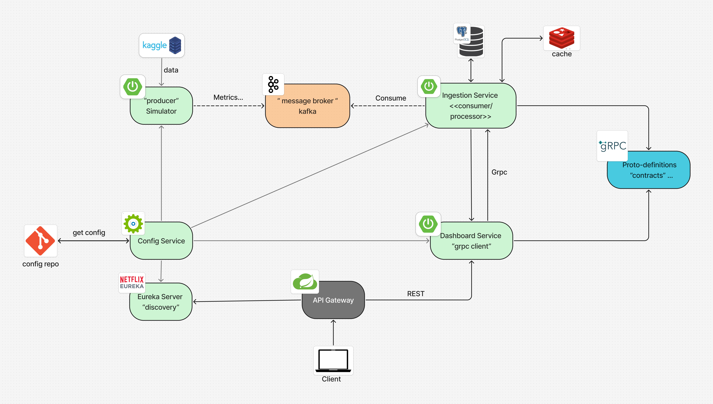

# vital metrics microservices system


A microservices-based health tracking system built with Spring Boot.
It simulates smartwatch data (steps, heart rate, sleep) using Kaggle Fitbit data , streams it through Kafka, processes it with microservices, and provides real-time & historical analytics through a dashboard.


## 🏗️ Architecture Overview

* **Simulator** → generates health events (based on Fitbit dataset)
* **Kafka** → message broker for streaming
* **Ingestion Service** → consumes, validates, and stores data (PostgreSQL + Redis)
* **Dashboard Service** → provides analytics
* **Gateway & Eureka** → API routing and service discovery
* **Config Service** → centralized configuration

### 📌  Schema 


---

## 🚀 Services

### 1. **Config Service** (`config-service`)

* Centralized configuration management
* Spring Cloud Config Server
* Port: **8888**

### 2. **Eureka Server** (`eureka-server`)

* Service discovery and registration
* Netflix Eureka Server
* Port: **8761**

### 3. **Gateway Service** (`gateway-service`)

* API Gateway for routing requests
* Spring Cloud Gateway
* Port: **8080**
* Features: load balancing, service discovery integration

### 4. **Ingestion Service** (`ingestion-service`)

* Core data ingestion & processing
* Spring Boot + Kafka + JPA + Redis + gRPC
* Port: **8081**
* Consumers: `StepConsumer`, `HeartrateConsumer`, `SleepConsumer`
* Storage: PostgreSQL (raw), Redis (real-time cache & aggregations)
* gRPC server for dashboard queries
### 5. **Dashboard Service** (`dashboard-service`)

* REST API for analytics
* Spring Boot Web + gRPC Client
* Port: **8082**

### 6. **Simulator** (`simulator`)

* Generates **realistic health data** for testing
* Based on Kaggle Fitbit dataset (📎 add link)
* Spring Boot + Kafka Producer
* Port: **8085**
* Producer services: steps, heartrate, sleep
* Scheduled data generation

### 7. **Proto Definitions** (`proto-definitions`)

* Protocol Buffer definitions for gRPC communication
* Generates Java classes for type-safe communication

---

## 🛠️ Technology Stack

* **Spring Boot 3.5.6**
* **Java 17**
* **Apache Kafka**
* **PostgreSQL** (persistent storage)
* **Redis** (real-time cache)
* **gRPC + Protobuf**
* **Spring Cloud** (Eureka, Gateway, Config)
* **Docker & Docker Compose**
* **Maven**

---

## 📊 Data Flow

1. Simulator generates Fitbit-based health data (steps, heart rate, sleep).
2. Events are published to Kafka topics:

    * `min-steps-events`
    * `heartrate-events`
    * `sleep-events`
3. Ingestion service consumes & validates messages.
4. Data storage:

    * Raw events → **PostgreSQL**
    * Aggregated data → **Redis**
5. Dashboard service fetches data via gRPC.
6. Clients access dashboard through **Gateway**.

---

##  Quick Start

### 1. Start Infrastructure

```bash
cd docker
docker-compose up -d
```
This starts PostgreSQL (5432), Redis (6379), Kafka (9092), Zookeeper (2181).

📌 **Note**:

* Place the **Kaggle Fitbit dataset** https://www.kaggle.com/datasets/arashnic/fitbit inside `simulator/src/main/resources/`.
* Configure the **config-repo** for Spring Cloud Config.

### 2. Generate Protocol Buffers

```bash
cd proto-definitions
./mvnw clean compile
```
### 3. Start Services (in order)

1. Config Service
2. Eureka Server
3. Simulator
4. Ingestion Service
5. Dashboard Service
6. Gateway Service
---

## 🔮 In Progress

* [ ] Authentication & authorization
* [ ] Advanced analytics (weekly/monthly trends)
* [ ] Distributed tracing
* [ ] Monitoring & alerting
